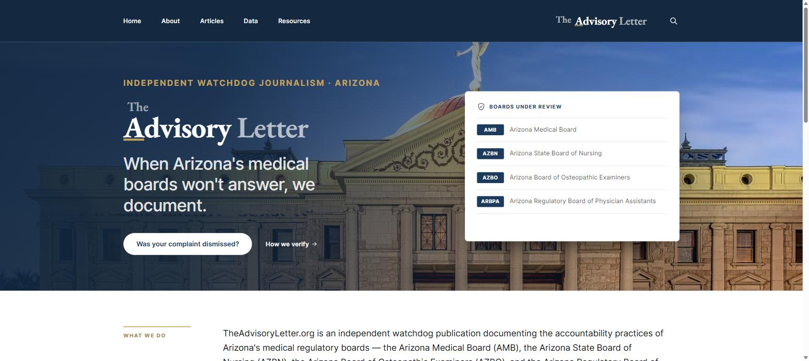
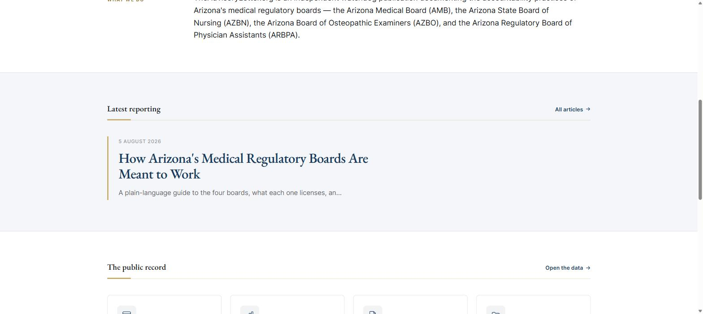
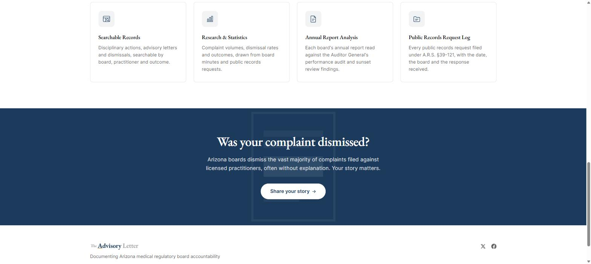

# TheAdvisoryLetter.org — Ghost theme

A custom Ghost theme built for **[TheAdvisoryLetter.org](https://www.theadvisoryletter.org/)**,
an independent watchdog publication documenting the accountability practices of Arizona's
medical regulatory boards.

**Live site:** https://www.theadvisoryletter.org/



---

## What this is

This is **customisation work, not a theme written from scratch.** It starts from
[Source](https://github.com/TryGhost/Source) v1.7.1, Ghost's official default theme
(MIT licensed — the original `LICENSE` and README are preserved in this repository as
[`LICENSE`](LICENSE) and [`README-source.md`](README-source.md)), and rebuilds it into a
publication with a specific job: a curated front page, a documents-and-records section,
and a long-form reading column that stays readable at length.

The approach was deliberate: **Source's own `built/screen.css` is left untouched** and every
publication-specific rule lives in one layered stylesheet, `assets/tal.css`. That keeps
upstream Source updates clean — the base theme can be refreshed without unpicking custom
work from it.

## What was built on top of Source

| Area | Work |
|---|---|
| `home.hbs` | A curated front page written from scratch — masthead band, "boards under review" card, statement band, latest reporting, the public-record grid and the closing call to action. Not a post feed. |
| `assets/tal.css` | ~64 KB publication stylesheet in 16 documented sections: tokens, typography, the front-page bands, inner-page reading column and rail, jump links, standing disclaimers, subscription panel, footer, mobile, reduced-motion and print. |
| `routes.yaml` | Custom routing: the front page renders a static page instead of a feed, and articles are collected under `/articles/`. Commented in plain English so the publisher can read it. |
| `articles.hbs`, `page.hbs`, `post.hbs`, `tag.hbs`, `author.hbs`, `error.hbs`, `index.hbs`, `default.hbs` | Reworked templates — masthead bands, reading measure, the section-jump list, share row and error states. |
| `partials/components/` | `wordmark.hbs`, `record-icon.hbs` written for this publication; `footer.hbs`, `post-list.hbs`, `share.hbs`, `subscribe.hbs` and `subscribe-inline.hbs` rewritten. |
| `assets/tal.js` | Front-end behaviour for the custom front page and navigation. |
| `assets/images/capitol.svg` | Hero artwork. |
| `package.json` | Seven new theme settings added to Ghost admin — `hero_eyebrow`, `cta_button_text`, `cta_button_url`, `cta_body`, `articles_title`, `articles_description`, `show_section_jump_links` — each with a plain-English description, so the publisher can change front-page copy without touching code. Twenty settings in total. |
| `locales/` | 16 locale files carried forward and updated for the renamed strings. |

## Design notes

Typography-led rather than image-led: EB Garamond for display and running text, Inter for
labels, navigation and metadata, JetBrains Mono for record identifiers. The reading column
is capped at a 680px measure so paragraphs actually get finished. A deep navy `#12283F`
carries the hero and the closing band, gold `#C4A35A` is spent sparingly on rules and
eyebrows, and everything else stays on paper white.

Every custom template and stylesheet section is commented in plain language, because the
publisher edits this site themselves.





## Structure

```
theadvisoryletter-theme/
├── default.hbs            parent template
├── home.hbs               curated front page
├── articles.hbs           article index
├── post.hbs  page.hbs  tag.hbs  author.hbs  index.hbs  error.hbs
├── routes.yaml            front-page and /articles/ routing
├── package.json           theme settings exposed in Ghost admin
├── assets/
│   ├── tal.css            publication styles (custom)
│   ├── tal.js             publication scripts (custom)
│   ├── built/             Source's compiled CSS/JS (unmodified)
│   ├── fonts/             EB Garamond, Inter, JetBrains Mono
│   └── images/capitol.svg hero artwork (custom)
├── partials/
│   ├── components/        navigation, footer, post-list, wordmark, record-icon, share, subscribe
│   ├── icons/             inline SVG icons
│   └── typography/        font-face definitions
└── locales/               16 translation files
```

## Installing

Requires Ghost 5.0 or later.

1. Zip the contents of this repository (the theme files at the top level, not a wrapping folder).
2. In Ghost admin go to **Settings → Design → Change theme → Upload theme**.
3. Activate it.
4. Upload `routes.yaml` under **Settings → Labs → Routes** for the custom front page and
   `/articles/` collection.
5. Create a page with the slug `home` — the front page renders that page's settings.

## Credits and licence

Built on [Source](https://github.com/TryGhost/Source) by the Ghost Foundation, used under
the MIT licence. Copyright (c) 2013–2026 Ghost Foundation — see [`LICENSE`](LICENSE).
Ghost's original theme documentation is preserved at [`README-source.md`](README-source.md).

Customisation and publication design by **Abdullah Al Mamun** ([@al-mamun](https://github.com/al-mamun)).
